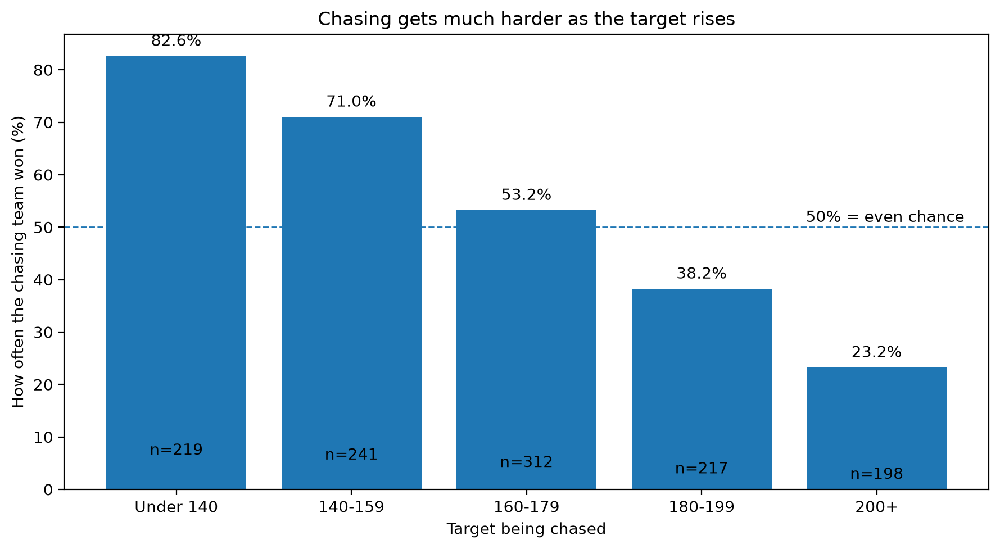
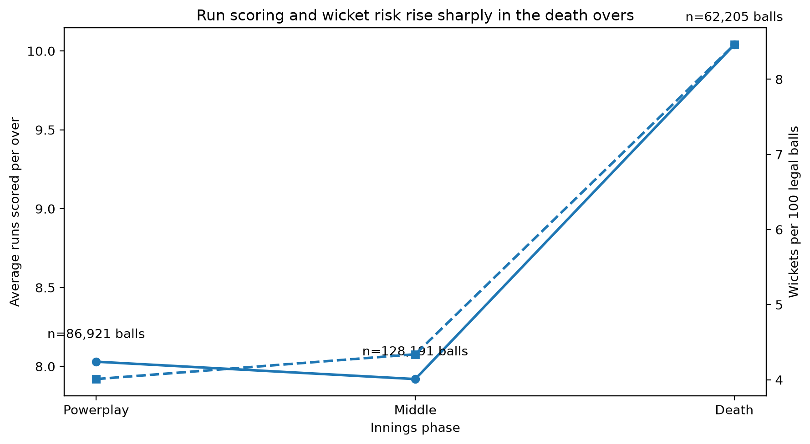
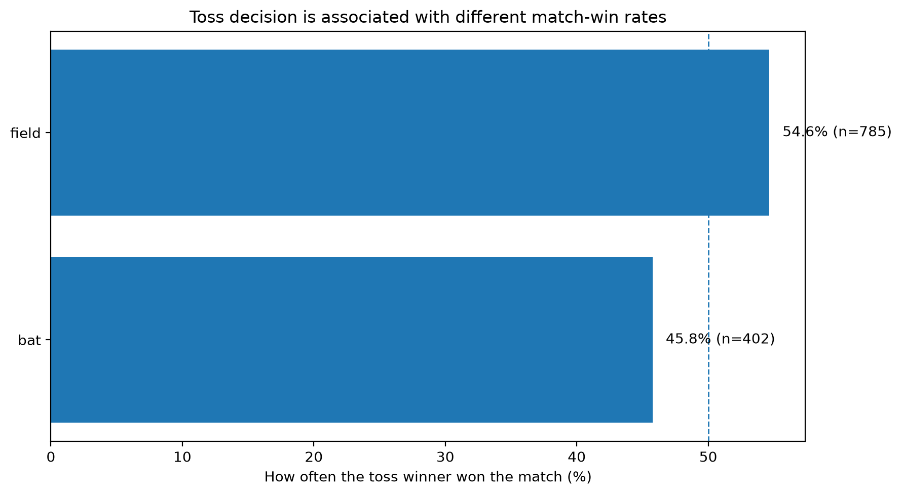
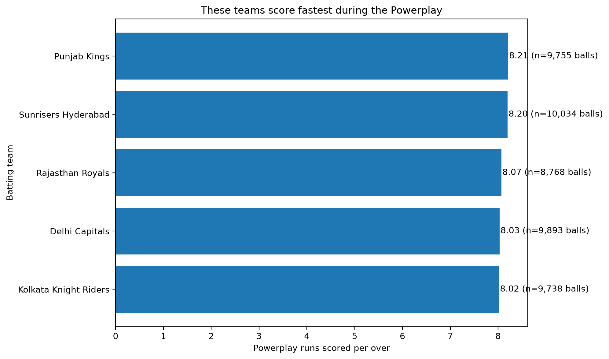

# IPL Cricket Analytics — Analysis Report
## Three findings I am least confident about
1. The toss decision result may be affected by other match conditions.
2. The phase comparison uses a large number of deliveries, but wickets and runs can vary between matches.
3. The Powerplay team comparison depends on the minimum ball threshold and historical team participation.
---
## Scenario H2
**Question:** Does chase success change by target band?
**Number:** Chase win rate falls from 82.6% for targets under 140 to 23.2% for targets of 200 or more.
**Population:** 1,187 completed matches/chases divided across five target bands.
**Decision:** Teams setting a high first-innings target should recognise that the chasing team has historically won less often as the target increases.
**Doubt:** The result may also be affected by team strength, venue, wickets lost and other match conditions.

---
## Scenario C1
**Question:** How do runs and wickets differ across the three innings phases?
**Number:** The Death phase has the highest scoring rate at 10.04 runs per over and the highest wicket rate at 8.46%.
**Population:** 277,317 legal balls across Powerplay, Middle and Death phases.
**Decision:** The Death phase requires attention to both scoring pressure and wicket risk.
**Doubt:** The phase averages combine matches from different teams, venues and seasons.

---
## Scenario G3
**Question:** Does the toss decision change the match result?
**Number:** Toss winners won 45.77% of matches when they chose to bat and 54.65% when they chose to field.
**Population:** 1,187 completed matches with a recorded toss decision and winner.
**Decision:** Toss decision can be included as one factor when analysing match strategy.
**Doubt:** The comparison is observational and does not show that the toss decision itself caused the difference.

---
## Scenario I1
**Question:** Which grounds have hosted the most matches?
**Number:** Wankhede Stadium has hosted 130 matches in the cleaned dataset.
**Population:** Matches grouped by cleaned venue name.
**Decision:** Venue-based comparisons should use the cleaned venue field rather than raw venue spellings.
**Doubt:** Match counts depend on the historical coverage of the dataset.

---
## Specialism — Powerplay Batting
**Question:** Which teams score fastest during the Powerplay?
**Number:** Punjab Kings have the highest Powerplay run rate among the displayed teams at 8.21 runs per over.
**Population:** Teams with at least 3,000 legal Powerplay balls.
**Decision:** Powerplay scoring rate can be considered when comparing batting approaches.
**Doubt:** Historical scoring rate does not guarantee future performance and may depend on players, seasons and opposition.

